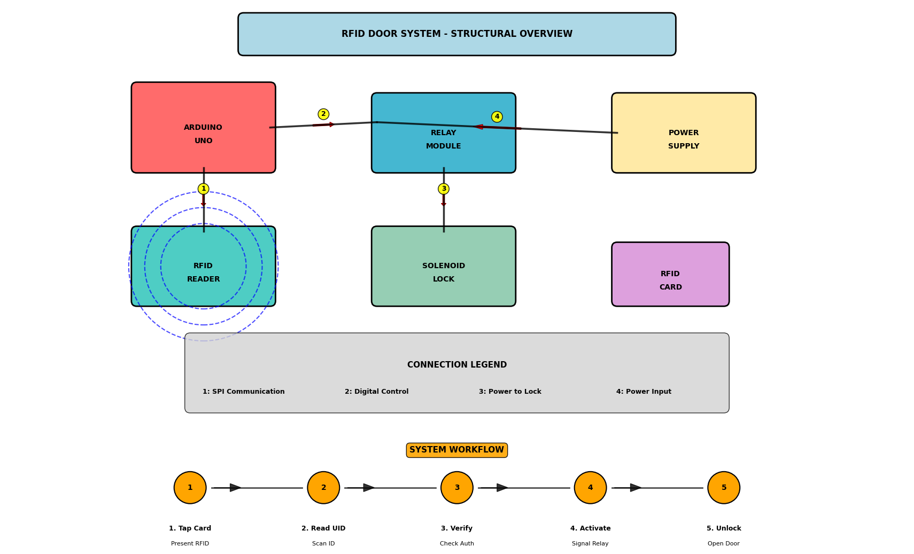
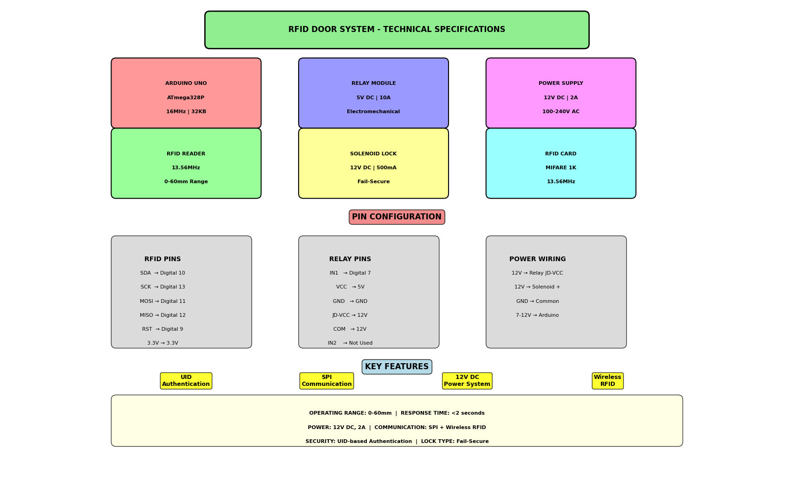
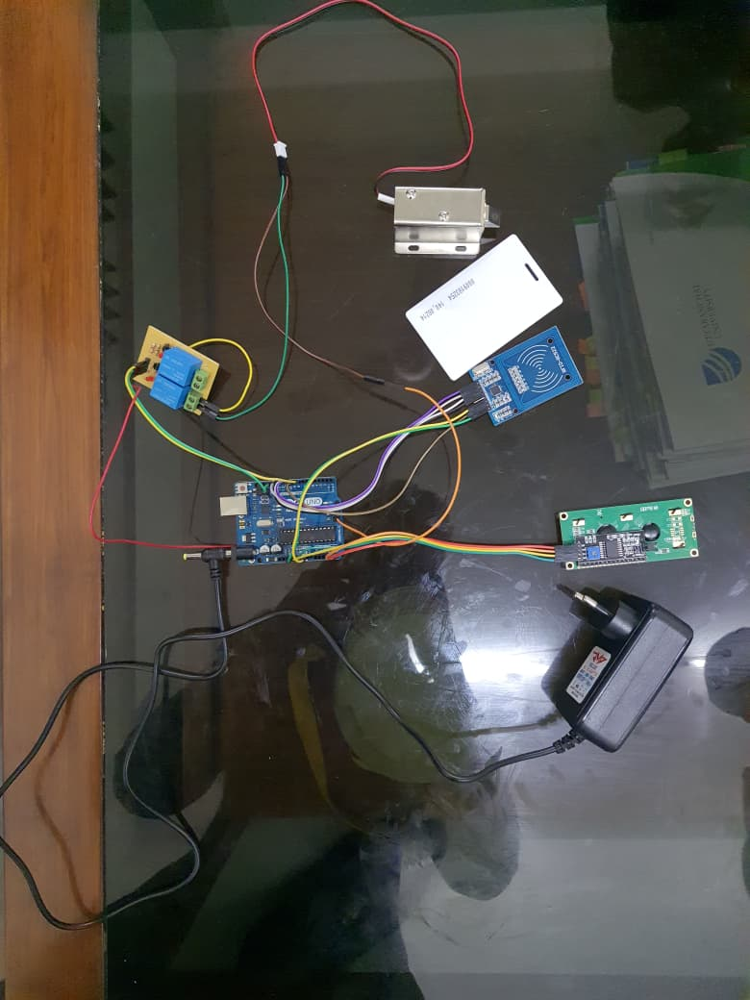

# RFID-Based Door Unlocking System 🔒

A college mini project implementing an IoT-based door access control system using RFID technology. This system allows secure door unlocking through RFID card authentication.




## 🎥 Project Demo

### Hardware Setup

*Actual hardware components connected and ready for testing*

### System in Action
[View Demo Video](media/videos/system_demo.mp4)
*Video demonstration of the RFID door unlock system working*

## 🚀 Project Overview

This project demonstrates a complete RFID-based access control system that:
- Authenticates users via RFID cards/tags
- Controls door locking mechanism using a solenoid lock
- Provides secure access with unique ID verification
- Uses Arduino as the main controller with proper power isolation

## 💻 Arduino Code

The complete Arduino code for the RFID door lock system is available in `src/arduino_code/rfid_door_lock.cpp`

### Key Features:
- RFID card authentication
- Solenoid lock control
- Access logging via Serial monitor
- Multiple authorized cards support
- Fail-secure operation

## 🛠️ System Components

| Component | Specification | Purpose |
|-----------|---------------|---------|
| Arduino UNO | ATmega328P, 16MHz | Main microcontroller |
| MFRC522 RFID | 13.56MHz, SPI interface | RFID card reading |
| Relay Module | 5V DC, 10A capacity | Power switching |
| Solenoid Lock | 12V DC, Fail-secure | Door locking mechanism |
| Power Supply | 12V DC, 2A | System power |

## 🔌 Circuit Connections

### RFID Module Wiring
- **SDA** → Digital Pin 10
- **SCK** → Digital Pin 13
- **MOSI** → Digital Pin 11
- **MISO** → Digital Pin 12
- **RST** → Digital Pin 9
- **3.3V** → 3.3V Power
- **GND** → Ground

### Relay Module Wiring
- **IN1** → Digital Pin 7
- **VCC** → 5V Power
- **GND** → Ground
- **JD-VCC** → 12V External Power

## 📋 System Workflow

1. **Card Tap** - User presents RFID card to reader
2. **UID Reading** - MFRC522 reads the unique card ID
3. **Authentication** - Arduino verifies against authorized IDs
4. **Relay Activation** - Signal sent to relay module
5. **Door Unlock** - Solenoid lock releases for access

## 🔧 Installation & Setup

Hardware Setup

1. Connect components as per circuit diagram
2. Ensure proper power connections
3. Verify all ground connections are common

Software Setup

# Install Python dependencies for diagrams
pip install -r requirements.txt

# Generate circuit diagrams
python src/generate_diagrams.py

Arduino IDE Setup

1. Install Arduino IDE
2. Add MFRC522 library via Library Manager
3. Upload src/arduino_code/rfid_door_lock.ino
4. Open Serial Monitor at 9600 baud

## 🖥️ Code Generation

The circuit diagrams in this repository were generated using Python. To regenerate them:

# Install dependencies
pip install matplotlib numpy

# Generate diagrams
python src/generate_diagrams.py


# 📊 Technical Specifications

Operating Range: 0-60mm
Response Time: <2 seconds
Power Requirements: 12V DC, 2A
Communication: SPI + Wireless RFID
Security: UID-based authentication
Lock Type: Fail-secure

# 📁 Project Structure
RFID-Door-Unlocking-System/
├── diagrams/                 # Generated circuit diagrams
│   ├── rfid_door_structural.png
│   └── rfid_door_technical.png
├── media/                   # Actual project media
│   ├── photos/
│   │   ├── component_setup.jpg
│   │   ├── wiring_closeup.jpg
│   │   └── README.md
│   └── videos/
│       ├── system_demo.mp4
│       └── README.md
├── src/
│   ├── generate_diagrams.py     # Python diagram generator
│   └── arduino_code/
│       └── rfid_door_lock.cpp   # Actual Arduino code
├── docs/
│   ├── component_specs.md
│   └── installation_guide.md
├── README.md
├── requirements.txt
├── .gitignore
└── LICENSE

# 🎯 Features

✅ RFID Card Authentication
✅ Secure UID-based Access Control
✅ Solenoid Lock Control
✅ Power Isolation Protection
✅ SPI Communication Protocol
✅ Fail-Secure Lock Mechanism

# 🔧 Skills Demonstrated

Embedded Systems Programming
RFID Technology Integration
Circuit Design & Implementation
Power Management
SPI Communication Protocol
Python Visualization
Technical Documentation

## 🖥️ Code Generation

The circuit diagrams in this repository were generated using Python. To regenerate them:

```bash
# Install dependencies
pip install matplotlib numpy

# Generate diagrams
python src/generate_diagrams.py
